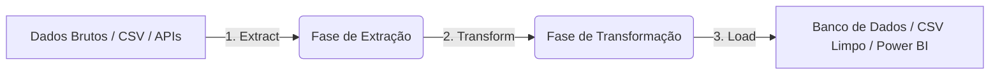

# ETL Pipelines com Python, Pandas e NumPy 📊

A engenharia de dados utiliza o processo **ETL (Extract, Transform, Load)** como espinha dorsal para integrar, tratar e disponibilizar dados consistentes para análise estratégica e BI.

## 1. O Fluxo de Dados (ETL)



### A. Extração (Extract)
Consiste em buscar dados de diferentes origens (Arquivos Locais, Bancos SQL/NoSQL, Web Scraping ou requisições de APIs REST).
* Em Python, comumente utiliza-se `pandas.read_csv()`, `pandas.read_sql()` ou bibliotecas como `requests` e `BeautifulSoup` para mineração de dados.

### B. Transformação (Transform)
Fase de sanitização e estruturação das informações, onde as principais regras de negócio são aplicadas:
* **Tratamento de Datas**: Converter strings para objetos Datetime (`pd.to_datetime`).
* **Tratamento de Nulos**: Preenchimento de dados vazios (`df.fillna()`) ou exclusão controlada (`df.dropna()`).
* **Validação Numérica**: Garantir valores positivos para quantidades e controle de cotas/limites de descontos.
* **Mapeamento**: Classificação categórica de produtos ou clientes usando dicionários dinâmicos.

### C. Carga (Load)
Etapa de exportação e persistência dos dados tratados.
* Exportação para arquivos estruturados de alta performance (`.csv`, `.parquet`).
* Escrita direta em bancos de dados relacionais (`df.to_sql`).

---

## 2. Conceito Crítico: Detecção de Outliers com IQR

A presença de anomalias/outliers pode distorcer médias estatísticas importantes (como ticket médio e previsões de vendas). O método clássico utilizado para filtragem é o **IQR (Interquartile Range - Amplitude Interquartílica)**.

### Cálculo Passo a Passo
1. Calcula-se o Primeiro Quartil ($Q1$ - percentil 25%) e o Terceiro Quartil ($Q3$ - percentil 75%).
2. O $IQR$ é a diferença entre eles: $IQR = Q3 - Q1$.
3. Estabelecem-se limites para considerar um dado normal:
   * **Limite Superior** = $Q3 + (1.5 \times IQR)$
   * **Limite Inferior** = $Q1 - (1.5 \times IQR)$
4. Qualquer valor além desses limites é rotulado como anomalia/outlier.

### Exemplo em Python/Pandas
```python
q1 = df["Faturamento"].quantile(0.25)
q3 = df["Faturamento"].quantile(0.75)
iqr = q3 - q1
limite_superior = q3 + 1.5 * iqr

df["Is_Outlier"] = df["Faturamento"] > limite_superior
```
