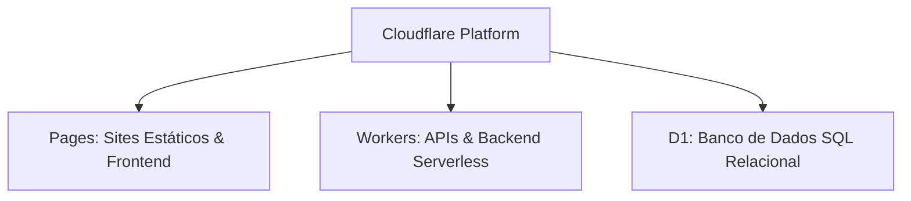

# Guia Prático: Deploy e Configuração na Cloudflare ☁️

A Cloudflare oferece uma plataforma robusta e de altíssima velocidade para hospedagem de aplicações e processamento serverless global na borda (Edge Computing). 

Este guia detalha o funcionamento e a utilização das principais ferramentas da plataforma: **Pages**, **Workers**, **D1 Database** e a interface de linha de comando **Wrangler**.

---

## 🚀 1. Pages vs. Workers vs. D1



### A. Cloudflare Pages
* **O que é**: Solução de hospedagem otimizada para ativos estáticos (HTML, CSS, JS) e frameworks modernos (React, Next.js, Vue).
* **Foco**: Portfólios, landing pages, blogs e documentações.
* **Escalabilidade**: Os arquivos são distribuídos diretamente na rede CDN global da Cloudflare, garantindo carregamento instantâneo.

### B. Cloudflare Workers
* **O que é**: Ambiente serverless de execução para JavaScript/TypeScript na borda (baseado no V8 engine).
* **Foco**: APIs REST, microsserviços, redirecionamentos inteligentes, middlewares de segurança.
* **Vantagem**: Cold starts (tempo de inicialização fria) de 0ms, rodando o código fisicamente mais perto do usuário final.

### C. Cloudflare D1
* **O que é**: Banco de dados SQL relacional totalmente nativo e serverless, baseado na engine do SQLite.
* **Foco**: Armazenar tabelas relacionais de sistemas web de forma leve e performática.

---

## 🛠️ 2. O Wrangler CLI (A Linha de Comando)

O **Wrangler** é a ferramenta oficial de linha de comando (CLI) usada para gerenciar, testar localmente e realizar o deploy de Workers e Pages na Cloudflare.

### Comandos Essenciais:

#### 1. Autenticação (Login)
Para conectar seu terminal local com a sua conta da Cloudflare:
```bash
npx wrangler login
```
*Este comando abre uma aba de autorização OAuth no seu navegador de internet padrão. Basta confirmar o acesso.*

#### 2. Verificar Sessão Ativa
Para conferir se o terminal está conectado e quais as permissões do token:
```bash
npx wrangler whoami
```

#### 3. Criar Projetos do Pages
Para criar um espaço reservado de projeto estático/hospedagem:
```bash
npx wrangler pages project create <nome-do-projeto> --production-branch main
```

#### 4. Realizar Deploy no Pages
Para fazer upload de uma pasta local de arquivos estáticos (como a pasta do portfólio):
```bash
npx wrangler pages deploy <caminho-da-pasta> --project-name <nome-do-projeto> --branch main
```
* **Nota**: Especificar `--branch main` garante que o deploy vá diretamente para o domínio de produção oficial (sem sufixos de preview).*

#### 5. Configurando Variáveis de Ambiente (Tokens de API)
Se você estiver em um ambiente automatizado ou servidor CI/CD, pode ignorar o login interativo por navegador configurando as chaves diretamente no ambiente:
* No Windows PowerShell:
  ```powershell
  $env:CLOUDFLARE_API_TOKEN = "seu_token_aqui"
  $env:CLOUDFLARE_ACCOUNT_ID = "seu_account_id_aqui"
  ```
