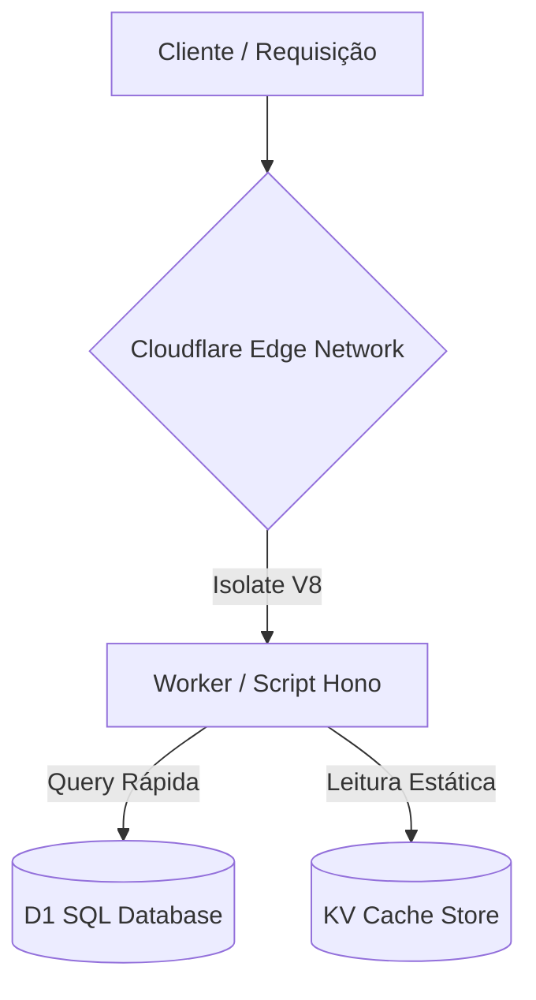

# APIs Serverless com Hono e Cloudflare Workers ☁️

**Cloudflare Workers** é uma plataforma serverless executada em cima da engine V8 do V8 isolate (Edge Computing), proporcionando tempos de inicialização (cold starts) praticamente zerados e tempos de resposta extremamente rápidos globalmente.

O **Hono** é um framework web ultrarrápido, leve e moderno projetado especificamente para ambientes de Edge (como Cloudflare Workers, Deno, Bun e Lagon).

## 1. Arquitetura Serverless



### Por que Hono?
* **Minimalista**: Pesa menos de 15KB gzipped.
* **Seguro e Tipado**: Totalmente construído em TypeScript com suporte a rotas estritas.
* **Roteamento Excepcional**: Roteador rápido baseado em árvores Radix.
* **Middleware nativo**: CORS, autenticação JWT, Logger, e compressão integrados.

---

## 2. Conectando Banco de Dados D1 com Drizzle ORM

O **Cloudflare D1** é o banco de dados SQL nativo e serverless da Cloudflare, baseado no SQLite. Para gerenciar e estruturar tabelas de forma robusta e segura, utiliza-se o **Drizzle ORM**.

### Estrutura Base de Schema com Drizzle
```typescript
import { sqliteTable, text, integer } from 'drizzle-orm/sqlite-core';

export const users = sqliteTable('users', {
  id: text('id').primaryKey(),
  name: text('name').notNull(),
  email: text('email').unique().notNull(),
  createdAt: integer('created_at', { mode: 'timestamp' }).notNull()
});
```

### Inicializando Servidor com Hono
```typescript
import { Hono } from 'hono';
import { drizzle } from 'drizzle-orm/d1';
import { users } from './schema';

type Bindings = {
  DB: D1Database;
};

const app = new Hono<{ Bindings: Bindings }>();

app.get('/users', async (c) => {
  const db = drizzle(c.env.DB);
  const result = await db.select().from(users).all();
  return c.json(result);
});

export default app;
```
