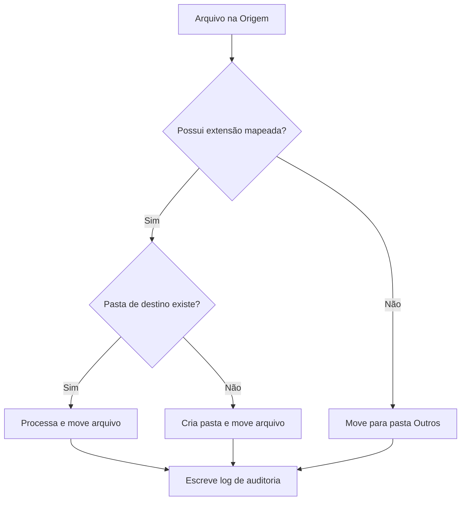

# 💻 Script de Organização & Fluxo — File Organizer

O script monitora diretórios locais do Windows e processa recursivamente os arquivos encontrados de acordo com o seu tipo MIME/extensão.

---

## Fluxo Operacional (Mermaid)



---

## Script do Organizador (PowerShell)

Abaixo está a implementação sênior que configurei para execução automática via Task Scheduler:

```powershell
# Caminhos do sistema
$SourcePath = "$Home\Downloads"
$DestinationBase = "$Home\Documents\Organizado"
$LogFile = "$DestinationBase\organizer_audit.log"

# Mapeamento de Extensões
$ExtensionMap = @{
    ".pdf"  = "Documentos\PDFs"
    ".docx" = "Documentos\Word"
    ".xlsx" = "Documentos\Planilhas"
    ".png"  = "Imagens"
    ".jpg"  = "Imagens"
    ".zip"  = "Compactados"
    ".rar"  = "Compactados"
    ".exe"  = "Instaladores"
}

# Garante a existência do destino e arquivo de log
if (-not (Test-Path $DestinationBase)) { New-Item -ItemType Directory -Path $DestinationBase -Force }
if (-not (Test-Path $LogFile)) { New-Item -ItemType File -Path $LogFile -Force }

# Varredura de arquivos
Get-ChildItem -Path $SourcePath -File | ForEach-Object {
    $Ext = $_.Extension.ToLower()
    $SubFolder = $ExtensionMap[$Ext]
    
    if (-not $SubFolder) {
        $SubFolder = "Outros"
    }
    
    $DestFolder = Join-Path $DestinationBase $SubFolder
    if (-not (Test-Path $DestFolder)) { New-Item -ItemType Directory -Path $DestFolder -Force }
    
    $DestFile = Join-Path $DestFolder $_.Name
    $Timestamp = Get-Date -Format "yyyy-MM-dd HH:mm:ss"
    
    # Tratamento de Colisão de Nomes
    if (Test-Path $DestFile) {
        $UniqueName = "$($_.BaseName)_$(Get-Date -Format 'yyyyMMddHHmmss')$($_.Extension)"
        $DestFile = Join-Path $DestFolder $UniqueName
    }
    
    Move-Item -Path $_.FullName -Destination $DestFile -Force
    Add-Content -Path $LogFile -Value "[$Timestamp] MOVED: $($_.Name) -> $SubFolder"
}
```
