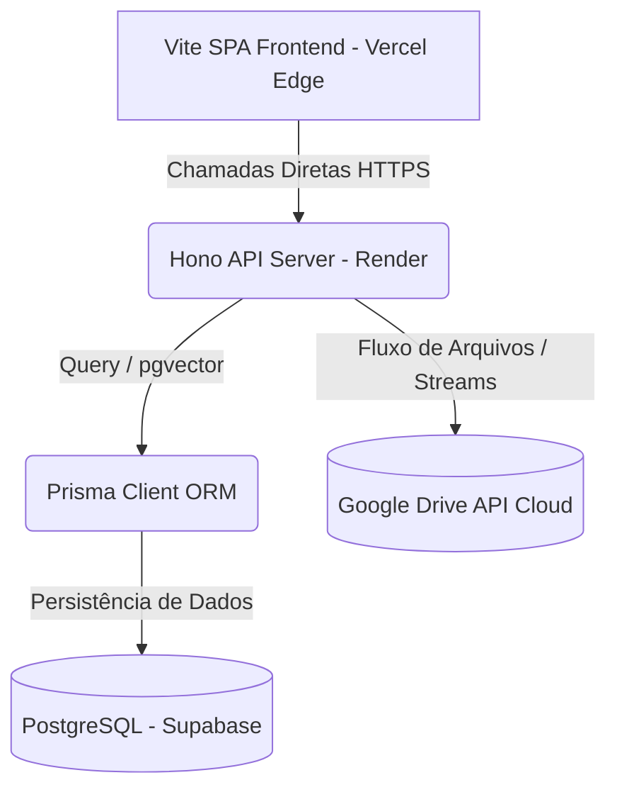

# Projeto: JurisHub (CRM & Plataforma SaaS Jurídica) ⚖️

Plataforma SaaS multi-tenant de alta performance desenvolvida para modernizar a operação de escritórios de advocacia, integrando CRM Kanban, timesheet dinâmico e inteligência artificial baseada em RAG para redação de petições.

## 🛠️ Arquitetura & Stack

*   **Frontend**: React (Vite), TypeScript, Tailwind CSS e Framer Motion.
*   **Backend / API**: Hono (TypeScript) executado em ambiente Node.js.
*   **Banco de Dados**: PostgreSQL (Supabase) gerenciado via Prisma ORM (suporte a `pgvector`).
*   **Armazenamento de Arquivos**: Google Drive API (v3) via Service Account.
*   **Hospedagem / Infraestrutura**: Frontend estático na Vercel CDN e Backend na Render (eliminando timeouts de IA).

---

## 🎯 Funcionalidades & Engenharia do Sistema

### 1. Isolamento Multi-Tenant em Banco de Dados
A plataforma adota o modelo de banco de dados compartilhado com isolamento lógico estruturado:
*   Todas as tabelas críticas (`Cliente`, `Processo`, `Andamento`, `Financeiro`) utilizam o identificador composto `tenantId`.
*   O `tenantMiddleware` intercepta o cabeçalho JWT no backend Hono, valida a sessão e injeta automaticamente o identificador correspondente no contexto de execução do banco de dados (Prisma client).

### 2. Provedor de Storage Dinâmico (Google Drive)
Para zerar custos de storage de objetos sem sobrecarregar o banco de dados:
*   Implementação de um provedor de upload (`storage.ts`) autenticado via chaves de Service Account do Google Cloud.
*   O sistema cria automaticamente uma estrutura de pastas `Cliente - [Nome]` e armazena os IDs das pastas dinamicamente, enviando PDFs e comprovantes via streams de dados eficientes.

### 3. Redação com Inteligência Artificial (RAG)
Mecanismo de auxílio à escrita jurídica que utiliza recuperação de trechos relevantes em background:
*   Os documentos enviados passam por quebra em blocos de texto (chunks) e geração de embeddings de 768 dimensões.
*   Busca semântica nativa no PostgreSQL via operador de distância de cosseno (`<=>`) antes do envio do contexto consolidado para o modelo de linguagem (Gemini Pro).
*   Fila de tarefas executada assincronamente por meio de trabalhadores (`aiWorker.ts` / `scheduler.ts`) para preservar a integridade do event loop da API principal.

### 4. Design System & CRM Kanban
*   Tokens de design centralizados em TypeScript (`colors.ts`, `spacing.ts`, `radius.ts`, `shadow.ts`, `motion.ts`) para padronização de temas e micro-animações (limite estrito de 240ms no Framer Motion).
*   Separação da tela de CRM em componentes funcionais e memoizados (`CRMFilters`, `CRMToolbar`, `Drawer`, `DetailsPanel`, `KanbanCard`) para performance de renderização.

---

## 🚀 Próximas Implementações

- [ ] Implementar autenticação via Auth0 ou provedores de Login Único (SSO).
- [ ] Exportação de relatórios gerenciais e de timesheet diretamente para planilha Excel/CSV.
- [ ] Integração com webhooks do Discord/Telegram para envio de notificações de prazos.
