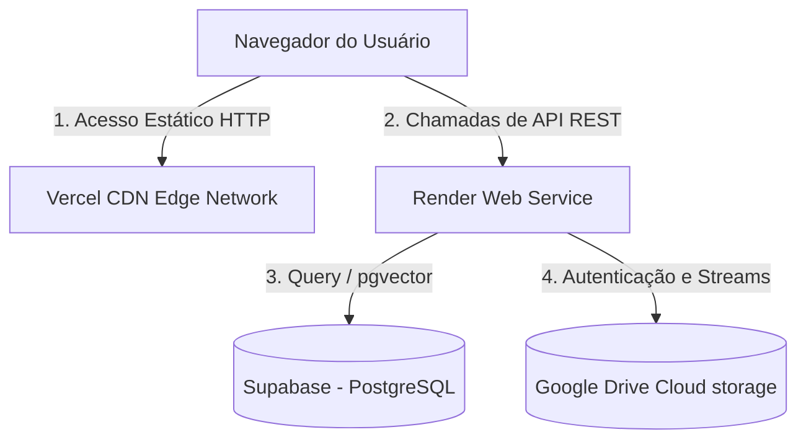

# 💻 Arquitetura de Sistemas & Fluxos — JurisHub

O **JurisHub** adota um modelo híbrido e descentralizado de infraestrutura para otimizar a velocidade de resposta, a latência de rede e a capacidade de processamento pesado de inteligência de dados.

---

## Diagrama de Implantação (Deployment Diagram)

A arquitetura separa fisicamente a entrega de ativos da interface estática (SPA) e o servidor de processamento dinâmico (API):

---

## Componentes do Sistema

1.  **Vite + React SPA (Hospedado na Vercel):** O frontend é compilado em arquivos estáticos (HTML/CSS/JS) e distribuído globalmente através da rede de borda (CDN) da Vercel. Isso zera a latência de renderização inicial da página.
2.  **API Server (Hospedado na Render):** Um servidor web persistente escrito em Node.js com o framework Hono. Diferente de serverless, esta instância roda continuamente, o que nos permite executar rotinas pesadas de processamento de texto e IA sem bloqueios de timeouts.
3.  **Supabase PostgreSQL (Banco de Dados Relacional):** Instância gerenciada do PostgreSQL que serve como armazenamento central das tabelas relacionais do sistema e dos índices de busca vetorial.
4.  **API do Google Drive (Armazenamento de Blob):** Provedor de storage externo integrado dinamicamente no backend, aliviando custos de tráfego de rede e armazenamento de mídias pesadas.
