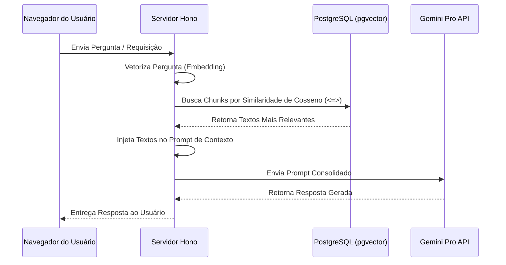

# 🤖 Motor de Inteligência Artificial & Pipeline RAG — JurisHub

O sistema de geração de petições jurídicas e consultas inteligentes do JurisHub foi projetado sob a arquitetura **RAG (Retrieval-Augmented Generation)**. Isso previne alucinações e garante respostas baseadas unicamente no acervo documental interno do escritório.

---

## Fluxo do Pipeline RAG



---

## Componentes Técnicos do Pipeline

### 1. Chunking e Divisão de Documentos
Para evitar perdas de significado e extrapolações do limite de contexto das chamadas da LLM, os documentos (PDFs, petições históricas) passam por uma quebra em blocos de texto limitados a 1000 caracteres, com uma sobreposição deslizante (overlap) de 200 caracteres para preservar a continuidade de sentenças em divisões de blocos.

### 2. Busca Vetorial (pgvector)
Os blocos de texto (chunks) são processados e convertidos em embeddings vetoriais de 768 dimensões. Para consultas semânticas, a aplicação calcula a distância vetorial de cosseno no PostgreSQL:

```typescript
const chunks = await prisma.$queryRaw`
  SELECT id, conteudo, (embedding <=> ${queryVector}::vector) as distancia
  FROM "DocumentChunk"
  WHERE "tenantId" = ${tenantId}
  ORDER BY distancia ASC
  LIMIT 3;
`;
```

### 3. Fila de Processamento Assíncrono
Para que o parsing de PDFs pesados e a geração de embeddings não degradem o tempo de resposta da API principal de backend, implementei um gerenciador de fila assíncrono (`aiWorker.ts` / `scheduler.ts`) rodando em concorrência controlada no servidor Render.
