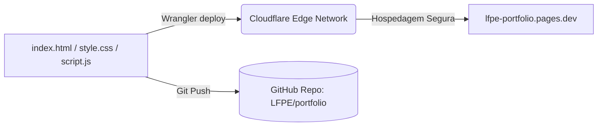

# Projeto: Portfólio Profissional (Designer-Grade) 🎨

Website pessoal responsivo, limpo e estruturado construído sob medida para apresentar competências em Engenharia de Sistemas (ADS) e Análise de Dados. O design segue uma abordagem editorial de alto impacto visual.

## 🛠️ Arquitetura & Stack

* **Frontend**: HTML5 Semântico, CSS3 Vanilla, JavaScript nativo.
* **Tipografia**: Playfair Display (Serif) e Inter (Sans-serif) via Google Fonts.
* **Hospedagem / Infraestrutura**: Cloudflare Pages.
* **Versionamento**: Git/GitHub (`LFPE/portfolio`).



---

## ⚙️ Diretrizes de Design Aplicadas (Sem "Cara de IA")

Para garantir que o site passasse uma imagem humana e séria, evitou-se o uso de templates clichês gerados por inteligências artificiais:
1. **Layout Editorial**: Substituição de grades simétricas cheias de cartões genéricos e sombras coloridas por um layout centralizado estruturado com espaçamento generoso.
2. **Tipografia Premium**: Uso do contraste entre títulos com a fonte serifada clássica *Playfair Display* (em itálico refinado) e o texto de corpo limpo com *Inter*.
3. **Micro-interações de Elite**: Links do menu superior com linhas de expansão central no hover e cards de projetos com bordas finas reativas (`#1a1e2b`) e deslocamento dinâmico da seta indicadora.
4. **Arte Linear Abstrata**: Inclusão de um vetor SVG técnico no Hero para compor a estética de engenharia do site.
5. **Sem Badges Shields.io**: As competências técnicas são apresentadas em tags monoespaçadas nativas em CSS, sem carregar imagens externas redundantes.

---

## 📁 Controle de Histórico Limpo (Git History)
Para manter o repositório organizado e profissional (sem dezenas de commits de testes intermediários), o repositório Git foi inicializado e comitado em um **único commit de entrega**:
```bash
git add .
git commit -m "feat: release do portfólio profissional de desenvolvimento e dados"
git push --force -u origin main
```
