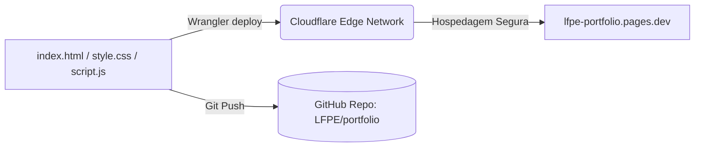

# 💻 Diretrizes de Design & Estrutura — Portfólio

O design do portfólio segue uma linha editorial focada na apresentação limpa de competências técnicas, livre de clichês visuais comuns de IA.

---

## Fluxograma de Hospedagem (Mermaid)

---

## Princípios de Design Aplicados

1.  **Layout Editorial:** Espaçamentos generosos e layout centralizado e focado, substituindo grades de cartões genéricos e sombras saturadas.
2.  **Contraste Tipográfico:** Uso do contraste de fontes refinadas (*Playfair Display* em itálicos clássicos para cabeçalhos e *Inter* sans-serif limpa para textos corporativos).
3.  **Micro-interações Reativas:** Menu de navegação superior com efeitos hover de expansão central e cards de projetos com translação sutil de setas indicadoras.
4.  **Vetor SVG Técnico:** Ilustração de traços lineares abstratos no topo (hero) para reforçar o foco em engenharia e dados.
