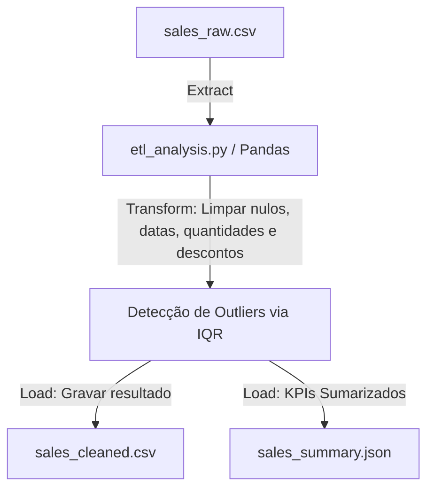

# Projeto: Sales Data Analysis (ETL Pipeline) 📊

Pipeline completo de Engenharia e Análise de Vendas corporativas, focado em limpeza de dados crus de faturamento, detecção estatística de anomalias (outliers) e geração de relatórios de receita para suporte à tomada de decisão.

## 🛠️ Arquitetura & Stack

* **Linguagens**: Python 3.
* **Ferramentas**: Pandas (data wrangling e estruturação), NumPy (lógica matemática), JSON (relatórios de metadados).
* **Estrutura**: Abordagem Orientada a Objetos com orquestração modular e logging estruturado nativo.

---

## ⚙️ Regras de Limpeza Aplicadas (Transformações)

1. **Padronização de Datas**: Suporta formatos `%Y-%m-%d` e `%d/%m/%Y` e realiza preenchimento automático para frente (`ffill()`) de datas ausentes.
2. **Quantidades Inválidas**: Transações com quantidades nulas ou negativas são normalizadas para a unidade mínima `1`.
3. **Controle de Desconto**: Restringe a margem de desconto entre `0.0` e `0.5` (máximo 50% de desconto permitido). Transações fora desse escopo têm desconto zerado.
4. **Tratamento de Nulos**: Métodos de pagamento vazios recebem a tag `"Não Informado"`.
5. **Detecção de Outliers**: Registra anomalias caso o faturamento líquido seja superior a $Q3 + (1.5 \times IQR)$, marcando a flag `Is_Outlier` para relatórios gerenciais e dashboards no Power BI.

---

## 🎯 KPIs Exportados no Relatório (`sales_summary.json`)

* Ticket médio de faturamento líquido.
* Região geográfica e Categoria de produto mais rentáveis do período.
* Divisão consolidada de receitas por região geográfica e categorias de mercado.
