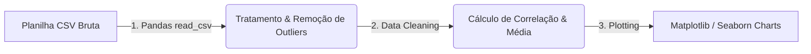

# 💻 Pipeline de Processamento (ETL) — Sales Data Analysis

O pipeline do projeto opera seguindo o modelo clássico de **ETL (Extract, Transform, Load)** de dados analíticos.

---

## Fluxo do Pipeline (Mermaid)

---

## Etapas do Processo

1.  **Extração (Extract):** Leitura de planilhas CSV com a biblioteca `pandas`.
2.  **Transformação (Transform):**
    *   Tratamento de células vazias (`NaN`) utilizando preenchimento de média ou descarte regulado.
    *   Conversão de formatos de datas e dados numéricos (limpeza de pontos e símbolos monetários).
    *   Filtragem de outliers estatísticos usando a regra de IQR (Intervalo Interquartil).
3.  **Visualização (Load/Plot):**
    *   Geração de mapas de calor (Heatmaps) para ilustrar correlação entre variáveis de desconto e volume de compras.
    *   Geração de gráficos de linha cronológicos de faturamento.
