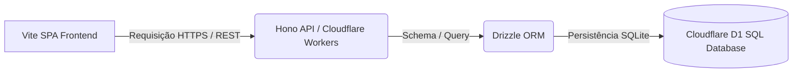

# Projeto: System Tracker 💻

Hub de automação profissional criado para centralizar, monitorar e digitalizar fluxos de trabalho operacionais, gerando relatórios de produtividade e acompanhamento de qualidade em tempo real.

## 🛠️ Arquitetura & Stack

* **Frontend**: React (Vite), TypeScript e Tailwind CSS.
* **Backend / API**: Hono (TypeScript) executado como uma API Edge no Cloudflare Workers.
* **Banco de Dados**: Cloudflare D1 (Banco relacional baseado em SQLite nativo na borda).
* **Persistência / Schema**: Drizzle ORM.

---

## 🎯 Funcionalidades Principais

- **Monitoramento de Tarefas**: Registro cronológico de execuções profissionais com carimbo de data/hora e operador.
- **Relatório Automático**: Geração de logs consolidados de erros e taxas de sucesso semanais.
- **Controle de Qualidade**: Formulários dinâmicos com validações específicas por setor.

---

## 🚀 Próximas Implementações

- [ ] Implementar autenticação via Auth0 ou JWT.
- [ ] Exportação de relatórios gerenciais diretamente para CSV/Excel.
- [ ] Integração de notificações por e-mail ou webhook de alerta (Discord/Telegram).
