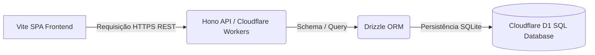

# 💻 Arquitetura de Sistemas — System Tracker

O **System Tracker** adota uma arquitetura em borda (Edge First), executando todo o processamento de rotas e banco de dados distribuído globalmente para reduzir a latência operacional a patamares mínimos.

---

## Fluxograma de Roteamento (Flowchart)

---

## Estrutura da Infraestrutura

1.  **SPA Frontend (Vite + React):** Distribuído via CDN na Cloudflare Pages.
2.  **API Gateway (Hono + Workers):** Executado como Workers da Cloudflare na borda. Hono atua como o motor leve de roteamento.
3.  **Cloudflare D1 SQL Database:** Banco de dados relacional distribuído baseado no SQLite nativo da borda Cloudflare.
4.  **Drizzle ORM:** Camada de mapeamento de objetos e migrações SQL.
