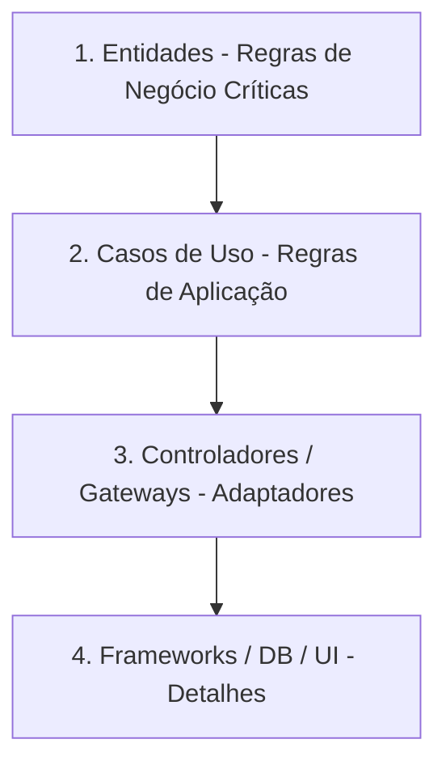

# Clean Architecture 🏗️

A **Arquitetura Limpa (Clean Architecture)** proposta por Robert C. Martin visa separar o código em camadas lógicas bem definidas, garantindo que as regras de negócio centrais não dependam de frameworks, bancos de dados, UI ou agentes externos.

---

## Estrutura das Camadas

---

## Princípios Fundamentais

### 1. Independência de Frameworks
O software não deve depender da existência de uma biblioteca específica (ex: Hono, Express, NestJS). Frameworks devem ser tratados como detalhes de infraestrutura fáceis de substituir.

### 2. Testabilidade
As regras de negócio (Casos de Uso) podem ser testadas isoladamente sem a necessidade de inicializar bancos de dados, servidores HTTP ou interfaces gráficas.

### 3. Independência de Banco de Dados
A lógica da aplicação não conhece a tecnologia de banco de dados utilizada (seja ela PostgreSQL, MongoDB ou SQLite). Toda a interação é feita através de abstrações (interfaces/repositórios).
