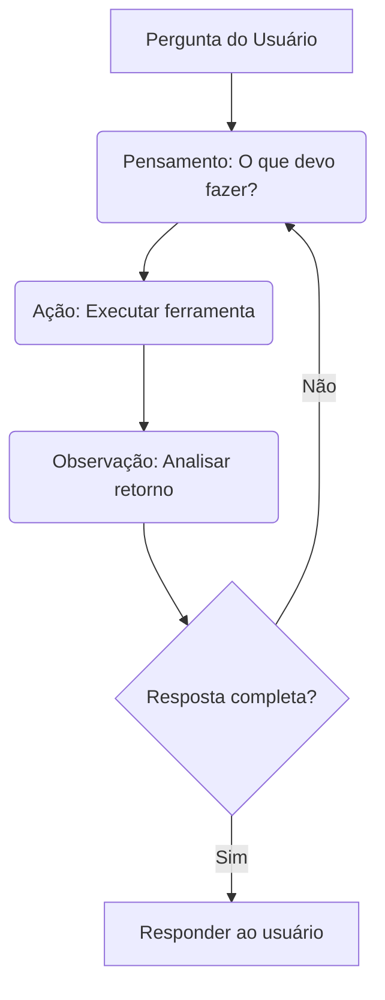

# 🤖 Configurações de Agentes de IA

Definição de fluxos de decisão automatizados baseados em chamadas recursivas de ferramentas por Agentes de IA (Function Calling).

---

## 1. Modelo de Agente Autónomo
Um agente opera no loop de execução **Reasoning and Action (ReAct)**:



---

## 2. Padrões de Declaração de Ferramentas (SDK)
Para que a LLM saiba quando e como chamar uma API, passamos o schema descritivo dos parâmetros (JSON Schema) nas chamadas de sistema:

```json
{
  "name": "get_clientes",
  "description": "Recupera a lista de clientes cadastrados no CRM filtrando por status",
  "parameters": {
    "type": "object",
    "properties": {
      "status": {
        "type": "string",
        "enum": ["novo", "em_andamento", "inativo"]
      }
    }
  }
}
```
