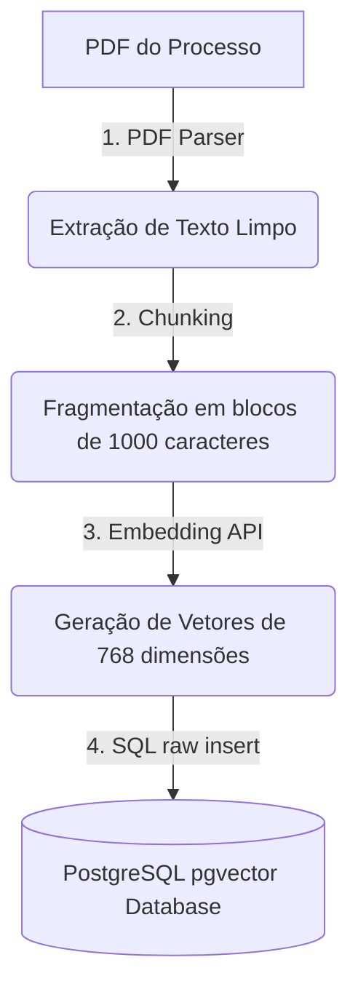

# 🔄 Fluxo de Trabalho (Workflow): Pipeline RAG

Definição do fluxo de processamento e recuperação de dados para Inteligência Artificial Jurídica.

---

## Estrutura do Pipeline RAG

---

## Descrição das Etapas
1.  **Parsing:** Extração do texto de arquivos PDFs.
2.  **Chunking:** Divisão do texto em blocos contendo sobreposição de 200 caracteres para evitar perdas semânticas de transição.
3.  **Vetorização:** Envio de texto limpo para gerar embeddings de similaridade.
4.  **Armazenamento:** Persistência de vetores e metadados no banco relacional para pesquisa ágil.
