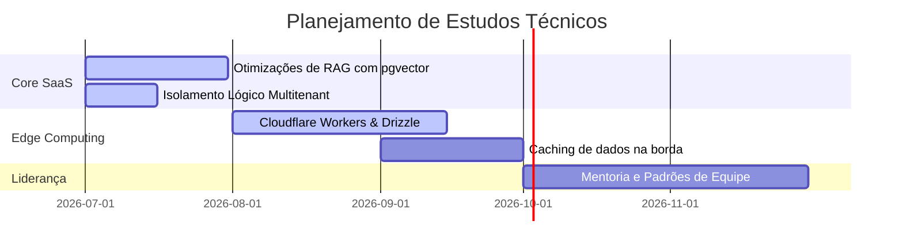

# Roadmap de Evolução Técnica: SaaS & Engenharia 📅

Milestones e metas de estudos práticos planejados de arquitetura e infraestrutura de larga escala.

---

## 📅 Roadmap 2026/2027

---

## Detalhamento das Metas

1.  **Otimizações de RAG (Julho 2026):** Estudo de chunking semântico para melhorar a relevância das chamadas de IA.
2.  **Edge Caching (Setembro 2026):** Implementação de estratégias Stale-While-Revalidate na borda da CDN Cloudflare para as APIs.
3.  **Mentoria (Outubro 2026):** Escrita de Playbooks de engenharia para formação técnica rápida de novos desenvolvedores.
