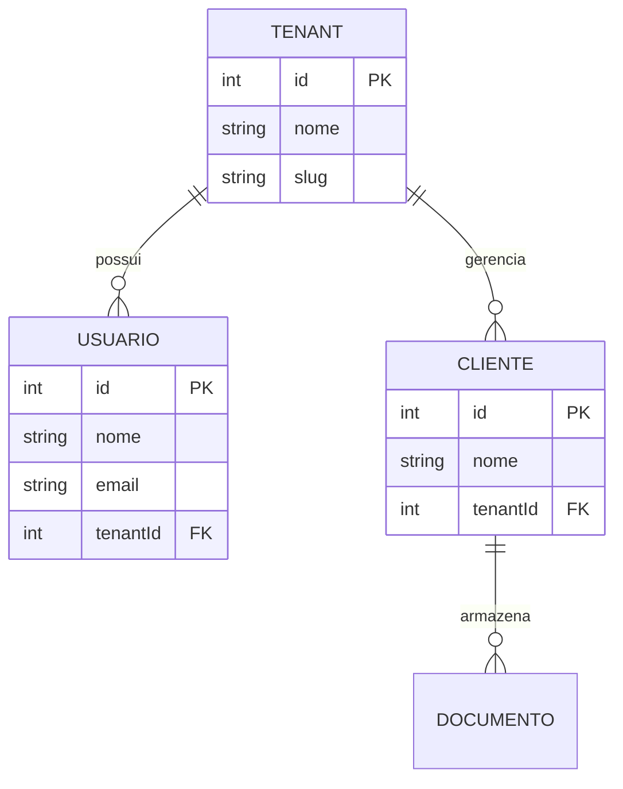

# Gabarito: Mermaid Entity-Relationship Diagram (ERD) 🗄️

Template de sintaxe do Mermaid para diagramas de modelo entidade-relacionamento de bancos de dados relacionais.

---

## Exemplo de Diagrama ERD (Modelo Relacional SaaS)

```text

```

### Visualização Renderizada

