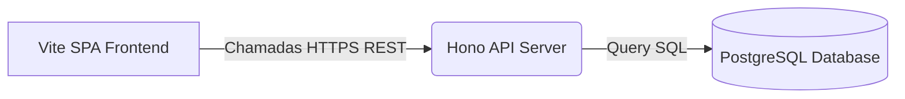
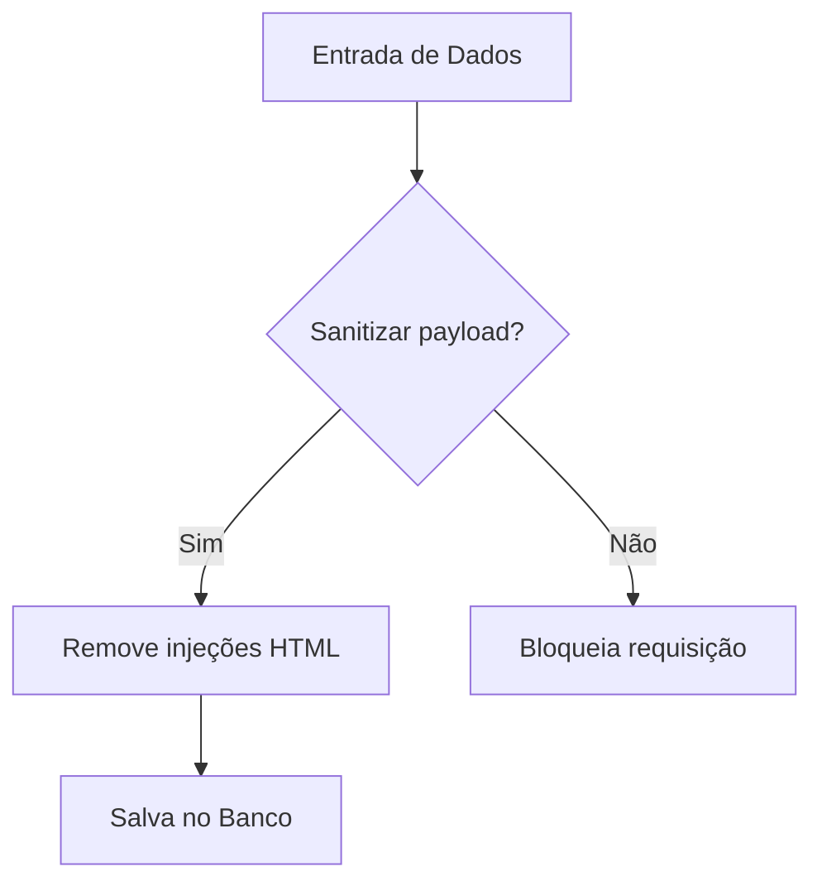

# Gabarito: Mermaid Flowchart 📊

Template de sintaxe do Mermaid para fluxogramas simples e complexos.

---

## 1. Fluxograma Esquerda-Direita (Left-to-Right)

```text

```

### Visualização Renderizada


---

## 2. Fluxograma Topo-Base (Top-to-Bottom)

```text

```

### Visualização Renderizada

