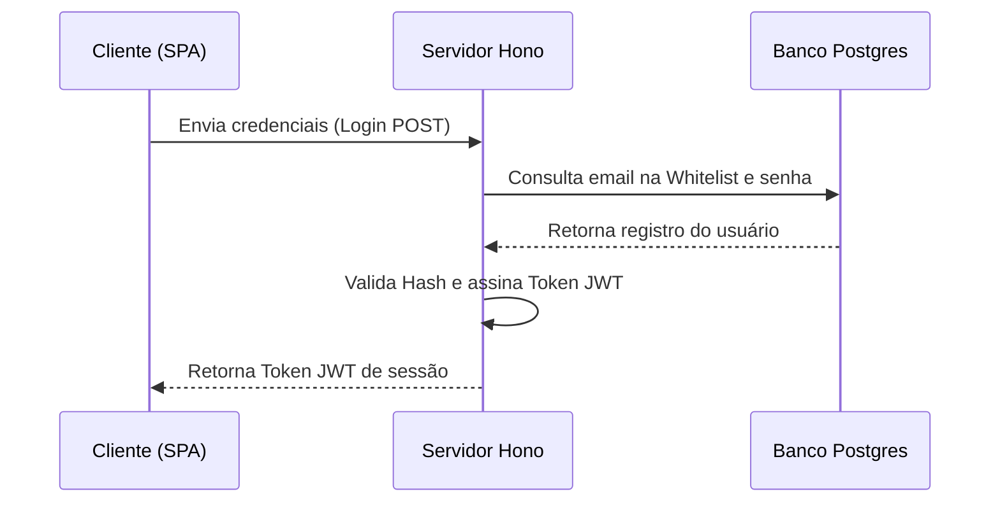

# Gabarito: Mermaid Sequence Diagram 🔄

Template de sintaxe do Mermaid para diagramas de sequência de troca de mensagens.

---

## Exemplo de Diagrama de Sequência (JWT Auth Flow)

```text

```

### Visualização Renderizada

