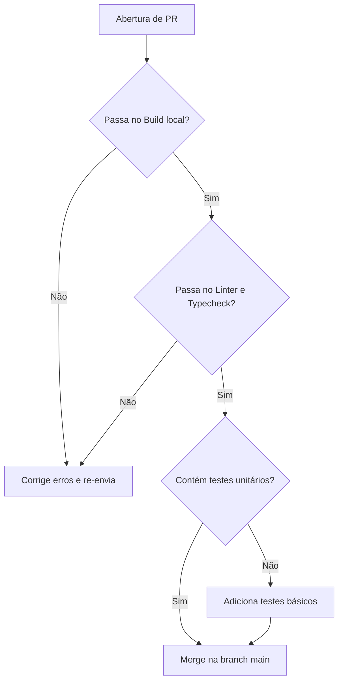

# Playbook: Code Review & PR Checklist 🔍

Lista de procedimentos operacionais e verificações obrigatórias para desenvolvedores realizarem revisões de código de novos recursos antes do merge na branch `main`.

---

## Fluxo de Code Review

---

## Checklist de Revisão de Código

### 1. Funcionalidade & Código
- [ ] O código cumpre a funcionalidade proposta na tarefa?
- [ ] Não existem dados ou segredos locais chumbados no código (ex: senhas do Supabase ou chaves do Drive)? Todo segredo está em variáveis `.env`.
- [ ] Foram removidos console.logs de desenvolvimento ou linhas de debug obsoletas?

### 2. Estilo & Estrutura
- [ ] As convenções de nomenclatura de arquivos (`PascalCase` para componentes React e `camelCase` para funções/scripts) foram respeitadas?
- [ ] Todos os novos componentes interativos ou modais possuem os focos e labels de acessibilidade (A11y) devidamente aplicados?
- [ ] Os pacotes importados nas dependências externas no `package.json` são realmente necessários ou a funcionalidade poderia ser escrita nativamente?
